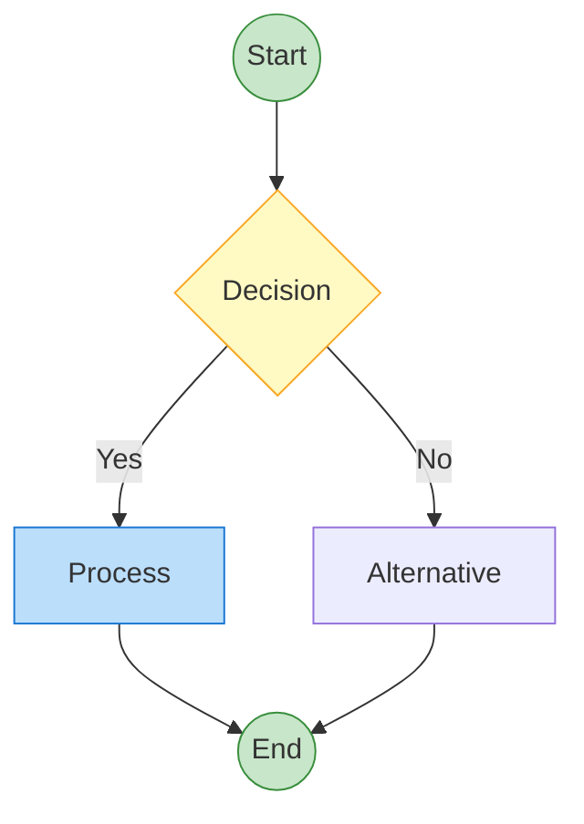

# Diagram-to-Excalidraw Converters

Automatically convert AI agent output and Mermaid diagrams to beautiful Excalidraw diagrams.

## 🚀 Quick Start

### 1. Install Dependencies
```bash
npm install
```

### 2. Convert JSON Agent Output
```bash
npm run convert
```

### 3. Convert Mermaid Diagrams
```bash
npm run convert-mermaid diagrams/sample-mermaid.md diagrams/output.excalidraw
```

### 4. Auto-watch Mode (JSON only)
```bash
npm run watch
```

## 📁 File Structure

```
diagrams/
├── converter.js              # JSON-to-Excalidraw converter
├── mermaid-to-excalidraw.js  # Mermaid-to-Excalidraw converter
├── watcher.js                # Auto-watch for JSON changes
├── agent-output.json         # Input: Your agent's JSON output
├── sample-mermaid.md         # Sample Mermaid diagram
├── output.excalidraw         # Output: Generated diagram
├── mermaid-output.excalidraw # Output: Mermaid conversion
├── viewer.html               # Web viewer for analysis
└── README.md                 # This file
```

## 📋 Input Formats

### JSON Agent Output Format

Your `agent-output.json` should follow this structure:

```json
{
  "title": "Your Diagram Title",
  "description": "Description of the diagram",
  "elements": [
    {
      "id": "unique-id",
      "type": "rectangle",
      "category": "process",
      "text": "Your text here",
      "x": 100,
      "y": 100
    },
    {
      "type": "arrow",
      "from": "source-id",
      "to": "target-id",
      "label": "Optional label"
    }
  ]
}
```

### Mermaid Format

Your Mermaid diagrams can be in `.md` files with code blocks or plain `.mmd` files:



## 🎨 Element Types

### Shapes
- `rectangle` - Standard box
- `ellipse` - Oval/circle
- `diamond` - Decision diamond

### Categories (Colors)
- `start` - Green (start points)
- `process` - Blue (standard processes)
- `decision` - Yellow (decision points)
- `end` - Red (end points)
- `fail` - Orange (failure states)
- `ai` - Purple (AI processes)
- `learning` - Light green (learning/adaptation)

### Connections
- `arrow` - Directional arrow
- `line` - Simple line

## 🎨 Mermaid Features Supported

### Node Shapes
- `A["text"]` - Rectangle
- `A{"text"}` - Diamond
- `A(("text"))` - Circle/Ellipse
- `A(["text"])` - Rounded rectangle (rendered as ellipse)
- `A("text")` - Simple circle

### Connection Types
- `A --> B` - Standard arrow
- `A -->|"label"| B` - Labeled arrow
- `A --- B` - Simple line
- `A ==> B` - Thick arrow

### Styling
- `classDef className fill:#color,stroke:#color` - Define custom colors
- `class nodeId className` - Apply styles to nodes
- Automatic color detection from class definitions

## ⚙️ Configuration Options

You can customize the conversion in `watcher.js`:

```javascript
convertJsonToExcalidraw(
  './diagrams/agent-output.json',
  './diagrams/output.excalidraw',
  { 
    theme: 'flowchart',        // 'flowchart' or 'system'
    autoLayout: true,          // Auto-position elements
    spacing: { x: 250, y: 120 } // Grid spacing
  }
);
```

## 🔄 Workflow

1. **Create/Update** `agent-output.json` with your diagram data
2. **Auto-conversion** happens instantly (if using watch mode)
3. **Open** `output.excalidraw` in VS Code with Excalidraw extension
4. **Edit** the diagram as needed
5. **Export** as PNG/SVG for sharing

## 🛠️ Advanced Usage

### Manual Conversion
```bash
node diagrams/converter.js input.json output.excalidraw flowchart
```

### Custom Themes
Edit `colorSchemes` in `converter.js` to add new themes.

## 📝 Example

See `agent-output.json` for a complete example showing Service-as-Software vs Conventional Methods comparison.

## 🔧 Troubleshooting

- **File not found**: Ensure `agent-output.json` exists
- **Invalid JSON**: Check JSON syntax with a validator
- **Missing elements**: Verify all referenced IDs exist
- **VS Code issues**: Install Excalidraw extension by pomdtr

## 🎯 Tips

- Use descriptive IDs for better debugging
- Keep text concise for better readability
- Test with small diagrams first
- Use auto-layout for quick prototyping
- Manually adjust positions for final polish
