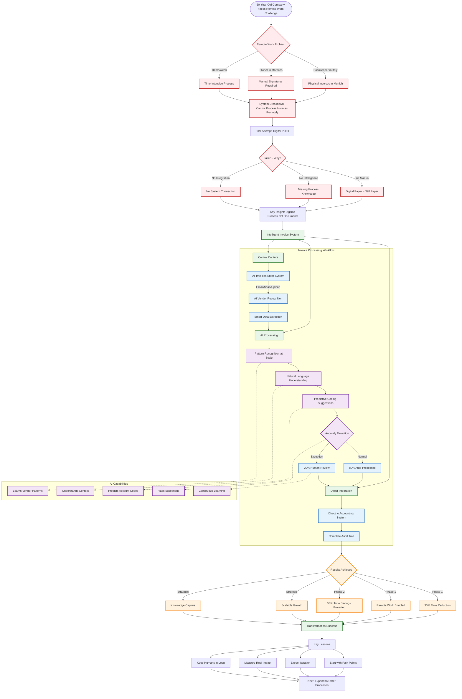

# German Company Invoice Processing - Complete Transformation

This is the comprehensive flowchart showing the complete transformation journey from problem to solution.

## Features Demonstrated:

1. **Complex Flow Structure** - Multi-phase transformation journey
2. **Subgraphs** - Organized workflow sections
3. **Multiple Decision Points** - Diamond shapes for key decisions
4. **Labeled Arrows** - Context for each connection
5. **Custom Color Coding** - Five distinct categories with custom colors
6. **Dotted Lines** - AI capability connections
7. **Comprehensive Coverage** - From problem identification to future planning
