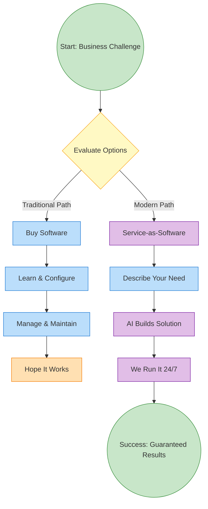

# Sample Mermaid Diagram

This is a sample Mermaid flowchart that demonstrates the conversion capabilities.

## Features Demonstrated:

1. **Different Node Shapes:**
   - `(("text"))` - Circles/ellipses for start/end
   - `{"text"}` - Diamonds for decisions
   - `["text"]` - Rectangles for processes

2. **Arrow Types:**
   - `-->` - Standard arrows
   - `-->|"label"|` - Labeled arrows

3. **Color Coding:**
   - Custom class definitions with fill and stroke colors
   - Class assignments to specific nodes

4. **Flow Direction:**
   - `flowchart TD` - Top Down layout
