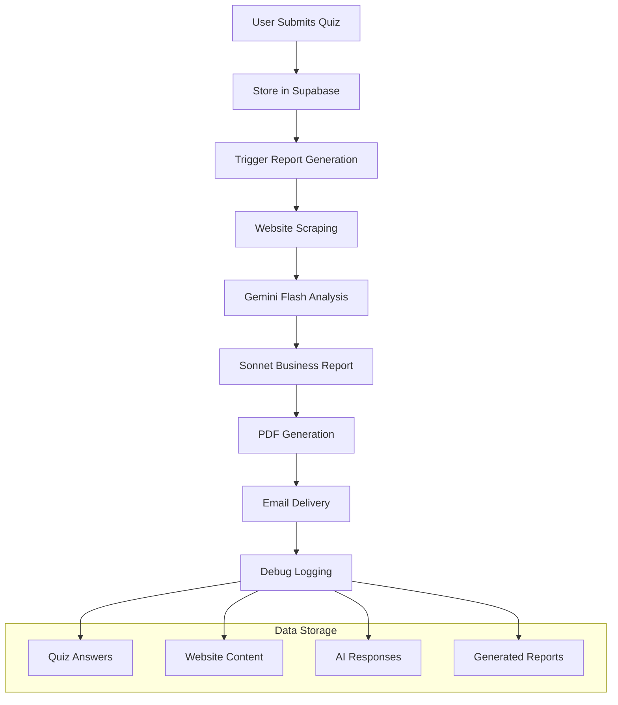

# VeloxForce Report Generation System

## Overview

The VeloxForce Report Generation System is a comprehensive AI-powered business analysis platform that transforms quiz responses into personalized business reports. The system combines website analysis, AI-powered insights, and automated report delivery to provide valuable business intelligence to SMB owners.

## System Architecture



## Technical Stack

### Core Technologies
- **Framework**: Next.js 14.1.0 with App Router
- **Language**: TypeScript 5.x (strict mode)
- **Database**: Supabase (PostgreSQL)
- **Styling**: Tailwind CSS 3.4.17
- **Components**: shadcn/ui (Radix UI based)

### AI & Analytics
- **AI Provider**: OpenRouter API
- **Models**: 
  - Gemini Flash 2.5 (`google/gemini-2.5-flash-preview-05-20`)
  - Sonnet 3.7 (`anthropic/claude-3.7-sonnet`)
- **Website Scraping**: Puppeteer
- **PDF Generation**: jsPDF
- **Email Service**: Resend API

### Development Tools
- **Forms**: React Hook Form + Zod validation
- **Date Handling**: date-fns
- **Icons**: Lucide React
- **Animations**: Framer Motion

## Data Flow Process

### 1. Quiz Submission (`/api/submit-quiz`)
```typescript
POST /api/submit-quiz
{
  contactDetails: {
    full_name: string,
    business_email: string,
    company_name: string,
    phone_number?: string,
    website?: string
  },
  departmentRoute: string,
  quizAnswers: Record<string, any>,
  summary: {
    calculatedScore: number,
    resultCategory: string
  }
}
```

**Process**:
1. Initialize debug session with timestamped folder
2. Validate required fields based on quiz type (service vs legacy)
3. Upsert client data in `audit_clients` table
4. Create quiz submission record in `audit_quiz_submissions`
5. Store individual answers in `audit_quiz_answers`
6. Trigger asynchronous report generation if website provided
7. Return success response with debug session ID

### 2. Report Generation (`/api/generate-report`)

#### Step 1: Website Scraping
- **Tool**: Puppeteer with headless Chrome
- **Target**: Landing page + sitemap discovery
- **Output**: Page content, headings, meta descriptions
- **Fallback**: Graceful degradation if scraping fails

#### Step 2: Sitemap Analysis (Gemini Flash 2.5)
- **Input**: Sitemap URLs and page priorities
- **Processing**: AI categorizes pages by business value
- **Output**: JSON structure with key pages identified
- **Purpose**: Optimize scraping for high-value content

#### Step 3: Business Analysis (Sonnet 3.7)
- **Input**: Quiz answers + website content + company context
- **Processing**: Generate comprehensive 3-page business report
- **Output**: Text/markdown formatted business analysis
- **Focus**: Actionable insights, ROI projections, recommendations

#### Step 4: PDF Generation
- **Tool**: jsPDF with custom formatting
- **Input**: Report text content + company metadata
- **Processing**: Convert markdown to formatted PDF
- **Features**: Cover page, proper typography, page breaks

#### Step 5: Email Delivery
- **Service**: Resend API
- **Template**: Professional HTML email with report preview
- **Attachment**: Generated PDF report
- **Tracking**: Email delivery confirmation

## Database Schema

### Tables
```sql
-- Client information
audit_clients (
  id: bigint PRIMARY KEY,
  email: text UNIQUE,
  phone_number: text,
  name: text,
  company_name: text,
  website: text,
  created_at: timestamp,
  updated_at: timestamp
)

-- Quiz submissions
audit_quiz_submissions (
  id: bigint PRIMARY KEY,
  client_id: bigint REFERENCES audit_clients(id),
  process_name_input: text,
  selected_process_type: text,
  calculated_score: integer,
  result_category: text,
  ai_analysis_status: text DEFAULT 'pending',
  created_at: timestamp
)

-- Individual quiz answers
audit_quiz_answers (
  id: bigint PRIMARY KEY,
  submission_id: bigint REFERENCES audit_quiz_submissions(id),
  question_id: text,
  question_text: text,
  answer_value: text,
  created_at: timestamp
)
```

## Key Files & Components

### API Routes
- **`/src/app/api/submit-quiz/route.ts`** - Quiz submission handler
- **`/src/app/api/generate-report/route.ts`** - Report generation orchestrator

### Core Libraries
- **`/src/lib/openrouter-client.ts`** - AI model integration
- **`/src/lib/website-scraper.ts`** - Puppeteer-based content extraction
- **`/src/lib/pdf-generator.ts`** - PDF creation from text reports
- **`/src/lib/email-service.ts`** - Email delivery with attachments
- **`/src/lib/debug-logger.ts`** - Comprehensive debugging system
- **`/src/lib/quiz-question-mapper.ts`** - Question text mapping

### Frontend Components
- **`/src/components/tools/audit/enhanced-working-service-quiz.tsx`** - Main quiz interface
- **`/src/components/tools/audit/question-renderer.tsx`** - Dynamic question rendering
- **`/src/components/tools/audit/results-display.tsx`** - Quiz results presentation

## AI Integration Details

### Gemini Flash 2.5 (Sitemap Analysis)
```typescript
Model: 'google/gemini-2.5-flash-preview-05-20'
Purpose: Fast sitemap analysis and page categorization
Input: Website sitemap with page priorities
Output: JSON structure identifying key business pages
Temperature: 0.3 (deterministic)
Max Tokens: 4000
```

### Sonnet 3.7 (Business Analysis)
```typescript
Model: 'anthropic/claude-3.7-sonnet'
Purpose: Comprehensive business report generation
Input: Quiz answers + website content + company context
Output: Text/markdown business report (3-page format)
Temperature: 0.4 (balanced creativity)
Max Tokens: 4000
System Prompt: Extensive business analyst persona with specific guidelines
```

### System Prompt Strategy
The Sonnet system prompt includes:
- **Role**: Senior Business Analyst specializing in SMB automation
- **Methodology**: Data integration → analysis → benchmarks → recommendations
- **Language Patterns**: Tentative, professional ROI language
- **Output Format**: 3-page structure (Executive → Analysis → Possibilities)
- **Guidelines**: Value-first, collaborative discovery approach

## Debug Logging System

### Directory Structure
```
debug-logs/
├── 2024-12-20_14-30-15_CompanyName/
│   ├── 1_input_quiz_data.json          # Quiz answers, contact details
│   ├── 2_input_website_data.json       # Scraped content, sitemap
│   ├── 3_ai_prompts.json               # Exact prompts sent to AI
│   ├── 4_ai_responses.json             # Raw AI responses
│   ├── 5_business_analysis.json        # Generated report content
│   ├── 6_pdf_report_data.json          # PDF generation data
│   ├── 7_email_data.json               # Email content/metadata
│   └── debug_log.txt                   # Timing summary
```

### Captured Data
- **Input Validation**: Quiz answers, contact details, question mapping
- **Website Analysis**: Scraping results, sitemap discovery, page content
- **AI Interactions**: Complete prompts, responses, model parameters
- **Report Generation**: Business analysis content, PDF data, email content
- **Performance**: Timing for each step, error tracking, success metrics

### Usage
```bash
# Test debug logging
node scripts/test-debug-logging.js

# Check debug logs
ls debug-logs/
cat debug-logs/[session-id]/debug_log.txt
```

## Environment Configuration

### Required Variables
```env
# Supabase Configuration
SUPABASE_URL=your_supabase_project_url
SUPABASE_KEY=your_supabase_service_key
NEXT_PUBLIC_SUPABASE_URL=your_supabase_project_url
NEXT_PUBLIC_SUPABASE_ANON_KEY=your_supabase_anon_key

# AI Services
OPENROUTER_API_KEY=your_openrouter_api_key

# Email Service
RESEND_API_KEY=your_resend_api_key

# Application
NEXT_PUBLIC_BASE_URL=http://localhost:3000  # or production URL
```

## Error Handling & Resilience

### Website Scraping
- **DNS Resolution Failures**: Graceful fallback with minimal content
- **Timeout Handling**: 30-second timeout with retry logic
- **Content Extraction**: Robust parsing with fallback methods

### AI Integration
- **Model Availability**: Error handling for invalid model IDs
- **Rate Limiting**: Exponential backoff for API limits
- **Response Validation**: Content verification before processing

### Email Delivery
- **API Failures**: Comprehensive error logging and user notification
- **Attachment Handling**: PDF validation before sending
- **Delivery Tracking**: Confirmation and error reporting

## Performance Considerations

### Optimization Strategies
- **Async Processing**: Report generation doesn't block quiz submission
- **Puppeteer Management**: Proper browser lifecycle management
- **Memory Usage**: Large content truncation and cleanup
- **Database Efficiency**: Upsert operations and indexed queries

### Typical Timing
- Quiz Submission: ~500ms
- Website Scraping: 5-15 seconds
- AI Analysis: 10-30 seconds  
- PDF Generation: 1-3 seconds
- Email Delivery: 2-5 seconds
- **Total Report Generation**: 20-60 seconds

## Security & Privacy

### Data Protection
- **Environment Variables**: All sensitive keys in env files
- **Database Access**: Service keys with minimal required permissions
- **API Security**: Input validation and sanitization
- **Debug Logs**: Automatically excluded from git (sensitive data)

### Content Safety
- **Prompt Injection**: System prompts designed to prevent manipulation
- **Output Validation**: Response content verification
- **User Data**: Minimal collection, secure storage

## Testing & Development

### Available Scripts
```bash
# Development
npm run dev                                    # Start dev server
npm run build                                 # Build production
npm run lint                                  # Run ESLint

# Testing & Analysis
node scripts/test-debug-logging.js            # Test debug system
node scripts/design-analysis.js               # UI analysis
node scripts/capture-all-pages.js             # Screenshot workflow
```

### Development Workflow
1. **Local Setup**: Configure environment variables
2. **Database**: Ensure Supabase migrations applied
3. **AI Access**: Verify OpenRouter API key permissions
4. **Email Testing**: Configure Resend for development domain
5. **Debug Monitoring**: Check debug-logs directory for issues

## Deployment Considerations

### Production Requirements
- **Node.js 18.x+**: Runtime environment
- **Memory**: 2GB+ for Puppeteer operations
- **Storage**: Temporary file cleanup for PDFs
- **Network**: Reliable connections for AI APIs

### Monitoring
- **Debug Logs**: Monitor for AI failures and processing errors
- **Email Delivery**: Track successful report deliveries
- **Performance**: Monitor report generation timing
- **User Experience**: Track quiz completion rates

## Future Enhancements

### Planned Improvements
- **Multi-language Support**: Internationalization for reports
- **Advanced Analytics**: Business intelligence on quiz patterns
- **Template Customization**: Department-specific report templates
- **Integration APIs**: Webhook support for external systems

### Scalability Considerations
- **Queue System**: Background job processing for high volume
- **Caching**: Website content caching for repeat analyses
- **Database Optimization**: Query optimization and indexing
- **CDN Integration**: PDF delivery optimization

---

*This documentation covers the complete VeloxForce Report Generation System as of December 2024. For specific implementation details, refer to the source code and debug logs.*